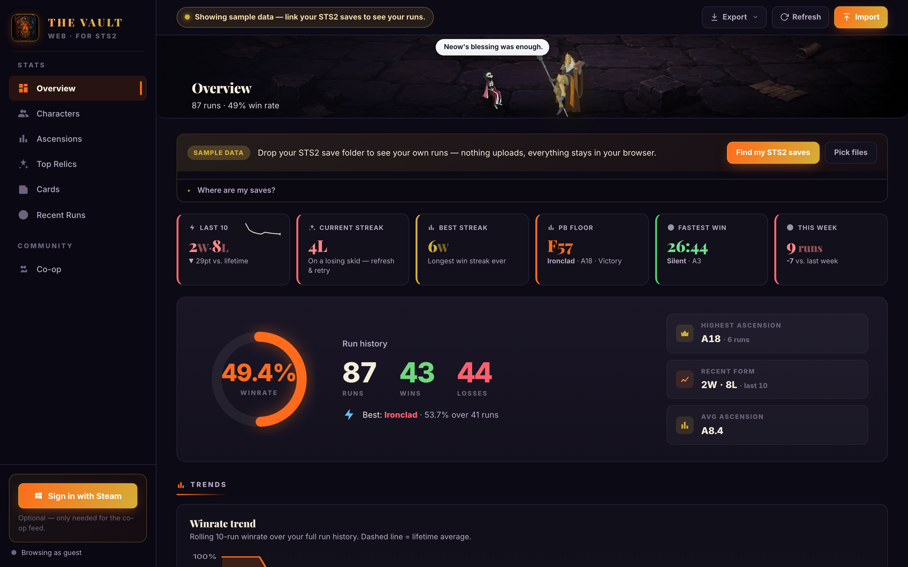
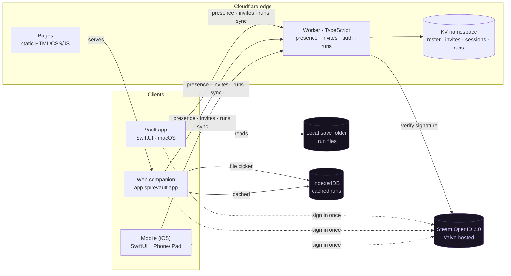
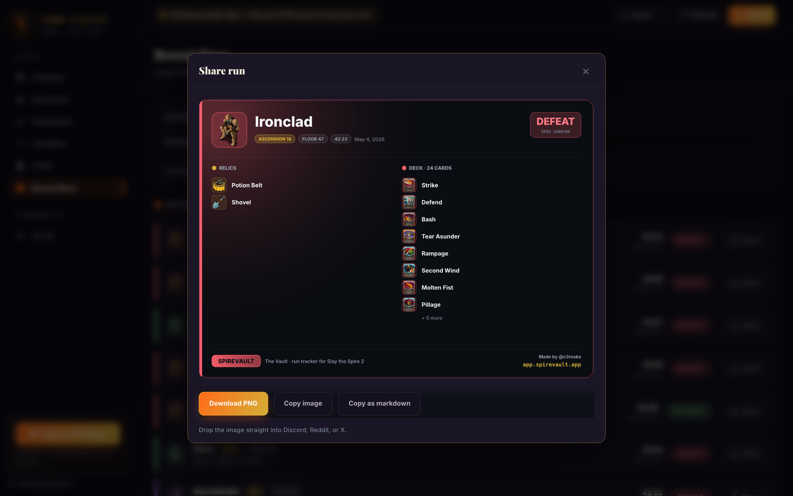
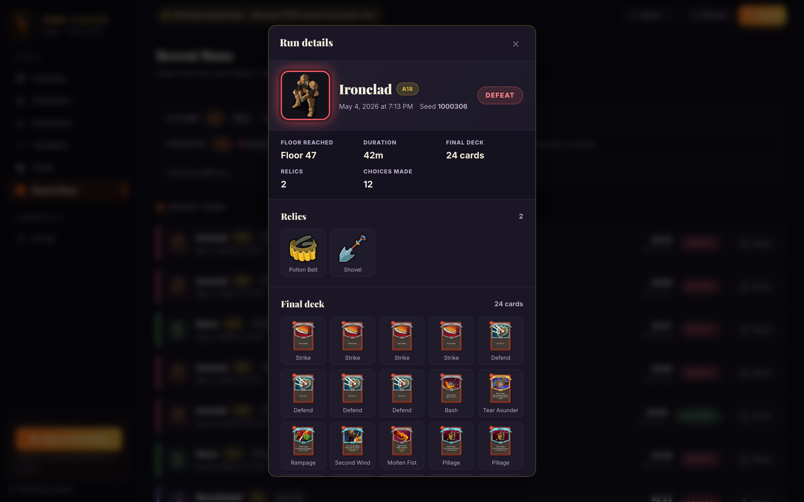
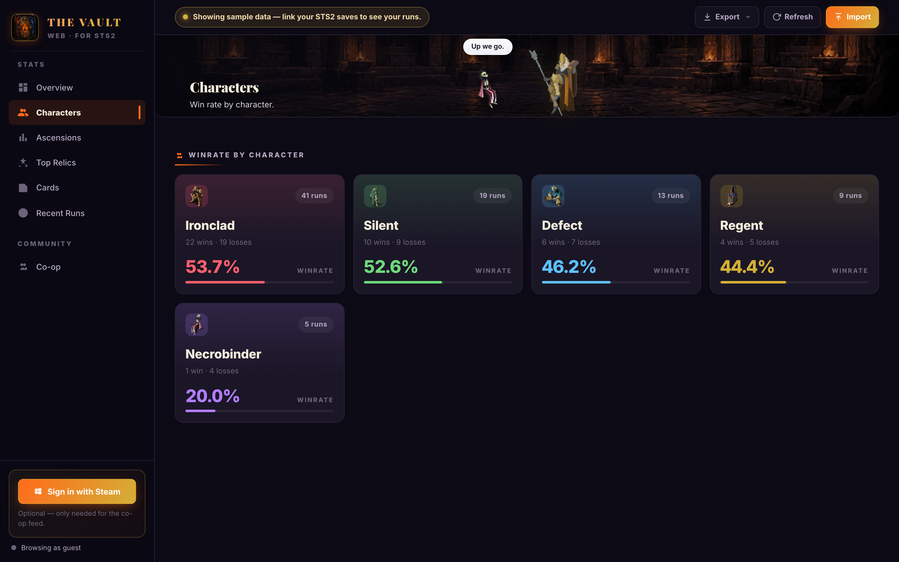
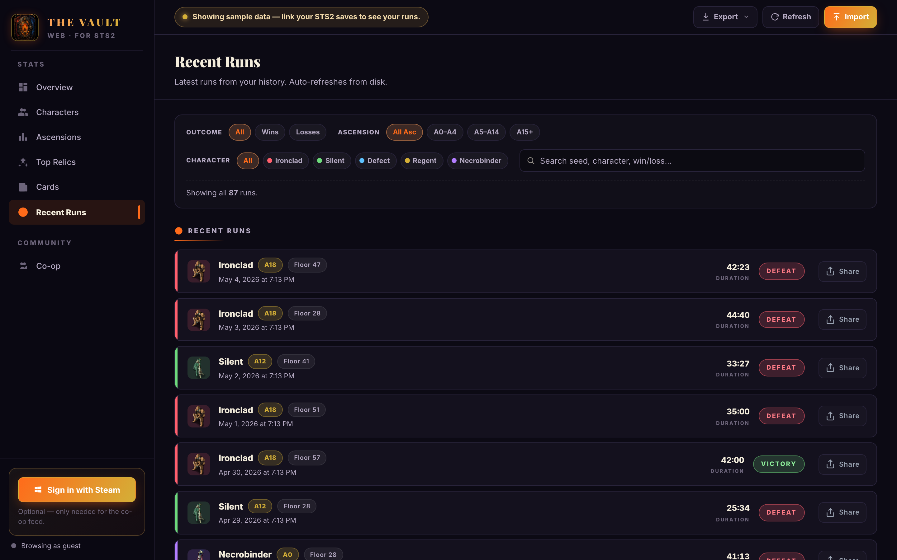
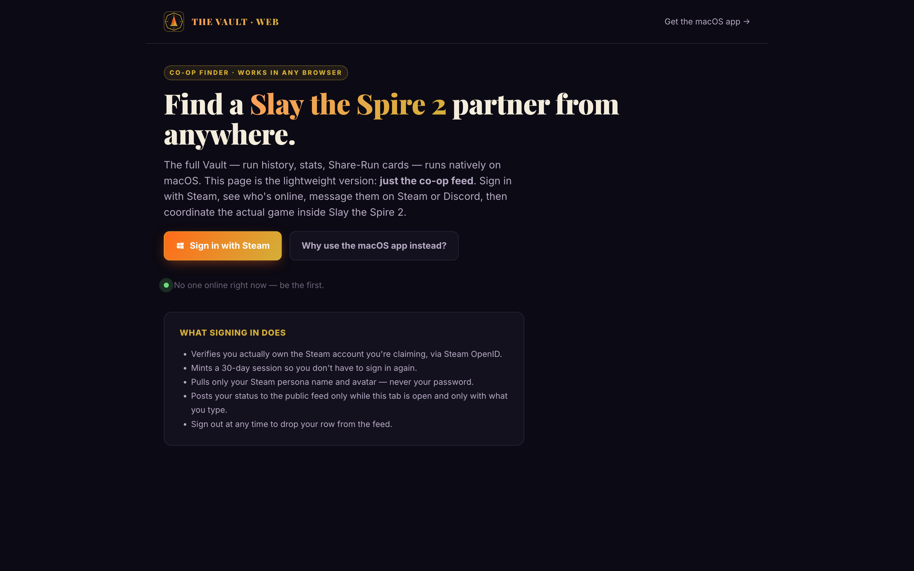

# Spire Vault

A free, open-source companion app for **Slay the Spire 2**. Tracks every
run you finish locally on your own machine, and shows you a live feed of
other players who are online and looking for a co-op partner right now.

<p align="center">
  <a href="https://app.spirevault.app">
    
  </a>
  <br />
  <sub><em>Click the screenshot to try the web version.</em></sub>
</p>

<p align="center">
  <a href="https://app.spirevault.app"><strong>Try it in your browser</strong></a>
  &nbsp;·&nbsp;
  <a href="https://spirevault.app"><strong>spirevault.app</strong></a>
  &nbsp;·&nbsp;
  <a href="https://github.com/c3rooks/SpireVault/releases"><strong>Download for macOS</strong></a>
</p>

<p align="center">
  <a href="LICENSE"></a>
  <a href="#install"></a>
  <a href="https://app.spirevault.app"></a>
  <a href="https://spirevault.app"></a>
</p>

## Architecture



**Cross-device run sync (v0.5).** When you sign in with Steam, the web
companion uploads your parsed run history to a Steam-ID-keyed cloud
copy. Open the iOS app on the same Steam account and your runs are
already there — no re-import, no QR-code pairing, no separate account.
Storage is the merged set across every device that ever uploaded for
your Steam ID, deduped by run id, last-write-wins on duplicate ids,
capped at 2,000 runs. Guests stay 100% local; no cloud copy is
created until you explicitly sign in.

Two clients (native macOS, browser) parse the same canonical `history.json`
schema and share a stats engine: Swift on macOS, a JavaScript port in the
browser. The server is a single Cloudflare Worker (around 1k lines of
TypeScript) plus one KV namespace; no Durable Objects, no D1, no queues.
Run history never leaves the client. The Worker only stores what a user
explicitly publishes for co-op (Steam ID, persona, status, optional
Discord handle, session token).

Worker layout, KV schema, and deploy steps live in
[`Backend/README.md`](Backend/README.md). Threat model and what is
explicitly *not* defended against is in [`SECURITY.md`](SECURITY.md).

> **Not a mod.** Spire Vault never injects into the game process, loads
> DLLs, or uses ModTheSpire. It only reads the `.run` JSON files Slay the
> Spire 2 already writes to your save folder, the same way you could open
> them in a text editor. Run-history readers like this have existed for
> the original Slay the Spire for years and are accepted by Mega Crit and
> the community.
>
> Not affiliated with Mega Crit Games. *Slay the Spire* is a trademark of
> Mega Crit.

---

## Why this exists

STS2's multiplayer is gated through Steam friends, which is the right
call. It keeps the experience tight and abuse-free. But it leaves a
missing layer: there's no way to *find* a partner before you
Steam-friend them.
Today, that means scrolling a Discord with a few hundred users and either
finding a level-0 newbie or someone grinding A20 Heart kills.

I built Spire Vault to fill that exact gap, nothing more. It does not host
games, route invites, or replace anything Mega Crit built. It just shows
you who else is around at your level, and gives you a one-click way to
reach out on Steam or Discord. From there, the actual game session goes
through Steam friends like normal.

The run-tracker came along for the ride because once I was already parsing
my own save files to compute my own skill tier, exposing the rest of the
data in a clean UI was a few extra weekends of work.

## More screens

Every screenshot below is a real capture of the v0.5 web companion
running on `app.spirevault.app` against sample data — same UI you get
once you sign in and import your `.run` files.

<p align="center">
  
  <br />
  <sub><em>Share-Run card with real relic icons + card art baked into the canvas. Drop straight into Discord, Reddit, or X.</em></sub>
</p>

<p align="center">
  
  <br />
  <sub><em>Click any run row to inspect the full deck and relic loadout.</em></sub>
</p>

<p align="center">
  
  <br />
  <sub><em>Characters tab — per-character winrate at a glance.</em></sub>
</p>

<p align="center">
  
  <br />
  <sub><em>Recent Runs with filter chips + click-to-inspect detail modal.</em></sub>
</p>

<p align="center">
  
  <br />
  <sub><em>Live co-op presence feed at <a href="https://app.spirevault.app">app.spirevault.app</a></em></sub>
</p>

## Install

There are two ways in. Both are free, both share the same live presence
feed, and you can use them on the same Steam account.

### Native macOS app (recommended for Mac users)

1. Grab the latest **`Spire-Vault-vX.Y.Z.dmg`** from the
   [Releases](https://github.com/c3rooks/SpireVault/releases) page.
2. Open the DMG and drag **The Vault** to your Applications folder.
3. First launch is ad-hoc signed (I don't pay Apple's $99/yr developer fee
   just to keep this free), so right-click the app → **Open**, then click
   **Open** in the dialog. macOS only asks once.

That's the whole install. The app auto-detects your STS2 save folder.
Co-op is one click away under the **Co-op** tab when you're ready.

### Web companion (Windows, Linux, Chromebooks, anywhere)

Open **<https://app.spirevault.app>** in any modern browser. The web
companion has the full feature set — co-op finder, run tracker (point it
at your STS2 save folder via the File System Access API), KPI strip,
winrate chart, image-rich Share-Run cards, and cross-device sync once
you sign in with Steam.

The first import uses a one-time folder picker (browsers require
explicit consent to read local files). After that, the same browser
auto-refreshes silently every 60s when STS2 writes new `.run` files,
and signed-in users get a Steam-ID-keyed cloud copy that any other
device on the same Steam account can read on next launch.

A native Windows build is on the roadmap but it's a full rewrite (the Mac
app is SwiftUI, which is Apple-only), so for now the web companion is the
official Windows and Linux path.

## How co-op actually works

Some people ask if I'm trying to replace Steam multiplayer or matchmake
for them. I'm not. Here's the four-step flow:

1. **Sign in with Steam.** Standard Steam OpenID, the same flow Steam
   uses for every other site. Your password never reaches my server.
2. **See who's online.** The Co-op tab shows everyone else with Spire
   Vault open right now. You see their Steam persona, avatar, current
   status (Looking / Playing / Idle), an optional self-declared skill
   tier, and an optional Discord handle.
3. **Reach out.** One click opens their Steam profile, copies their
   Discord handle to your clipboard, or fires `steam://friends/add/<id>`.
4. **Play.** You coordinate the rest over Steam or Discord (agreeing on
   a time, picking characters, whatever). The actual STS2 multiplayer
   game gets hosted and joined the same way you'd do it today.

Total infrastructure cost: **$0**. The whole thing runs on Cloudflare's
free tier. The only fixed cost in this entire project is the $14/year
domain, which I'm paying out of pocket because I think solving this
problem is worth fourteen bucks.

## Privacy, in plain English

The run tracker is fully offline. Nothing about your runs, decks, win
rates, or anything else ever leaves your Mac unless you sign into co-op.

When you sign into co-op, the server stores:

- Your verified Steam ID, persona name, and avatar URL (all from the
  public Steam Web API; nothing private).
- A status, a freeform note, and an optional Discord handle. Whatever
  *you* type into the app.
- A session token, valid for 30 days. Sign out and it's gone instantly.

That's the entire list. The server cannot read your save folder, run
history, password, email, payment info, or anything else, because it
isn't sent and never has been. I documented the full threat model and
what's deliberately out of scope in [SECURITY.md](SECURITY.md).

If you want to verify all this yourself, the Worker code in `Backend/`
is the exact code running in production. Anyone can audit it. Anyone can
fork it and point their own Spire Vault at a private deployment.

## Build from source

If you want to run it without trusting a pre-built binary, or you want to
hack on it:

```bash
git clone https://github.com/c3rooks/SpireVault.git
cd SpireVault/VaultApp
brew install xcodegen   # one-time, generates the .xcodeproj
make run
```

Requirements:

- Xcode 16 or later (macOS 13+ deployment target)
- `xcodegen` (one Homebrew install away)
- macOS on Apple Silicon or Intel

The CLI lives at `TheVault/` and builds independently with `swift build`
inside that directory. Useful if you want to dump your run history to
JSON or CSV without launching the full app.

## Repository layout

```
.
├── VaultApp/        Native macOS SwiftUI app (the thing you install)
├── TheVault/        Swift package: VaultCore library + `vault` CLI
├── Backend/         Cloudflare Worker for the co-op presence feed
├── Site/            Marketing landing page  (spirevault.app)
├── Web/             Browser companion         (app.spirevault.app)
├── SECURITY.md      Threat model + what's defended-against
├── CHANGELOG.md     What shipped when, what broke along the way
└── RELEASING.md     How to cut a new release
```

`VaultApp` depends on `TheVault` for parsing/stats so the two share code
without duplicating it. `Site` and `Web` are pure-static Cloudflare Pages
deployments with no build step and no runtime dependency. `Backend` is a
single Worker, around 1k lines of TypeScript total.

### Where each piece is hosted

| Component       | Hosted on              | URL                                              |
| --------------- | ---------------------- | ------------------------------------------------ |
| macOS app       | GitHub Releases        | [`/releases`](https://github.com/c3rooks/SpireVault/releases) |
| Backend Worker  | Cloudflare Workers     | `vault-coop.coreycrooks.workers.dev`             |
| Marketing site  | Cloudflare Pages       | <https://spirevault.app>                         |
| Web companion   | Cloudflare Pages       | <https://app.spirevault.app>                     |

## Who built this

I'm Corey Crooks. I play STS2 (Silent main, occasional Watcher when I
want to feel clever), I write code professionally, and I built this
because I got tired of scrolling Discord trying to find a co-op partner.

- Personal site: [coreycrooks.com](https://coreycrooks.com)
- GitHub: [@c3rooks](https://github.com/c3rooks)
- Reddit: [u/c3rooks](https://reddit.com/user/c3rooks)
- For security reports: see [SECURITY.md](SECURITY.md)

If you want to talk about a feature, a bug, or why you think one of my
design decisions is wrong, open an issue. If it's a security issue,
please go through the disclosure process in `SECURITY.md` first.

## Contributing

Issues and PRs welcome. The project is small enough that "open a PR" is
the entire workflow. No CLA, no contributor guide novella. If you want
to add a feature and aren't sure if I'd merge it, open an issue first
and ask. I'd rather say "yes, but go this way" than have you spend a
weekend on something I'd close.

## License

[MIT](LICENSE). Do whatever you want with it. Fork it, run it private,
sell a paid version with extra features, ship a Linux port. All fine.
The only thing I ask is keep the privacy posture intact if you fork:
local run history stays local, co-op stays opt-in, no surprise
telemetry. The community will notice and it'll reflect on the original.

## Thanks

To Mega Crit, for making the best card game ever and not being weird
about fan tools. To the STS2 Discord regulars who answer "anyone want
to co-op?" at 11pm on a Tuesday. You're the reason this exists.
