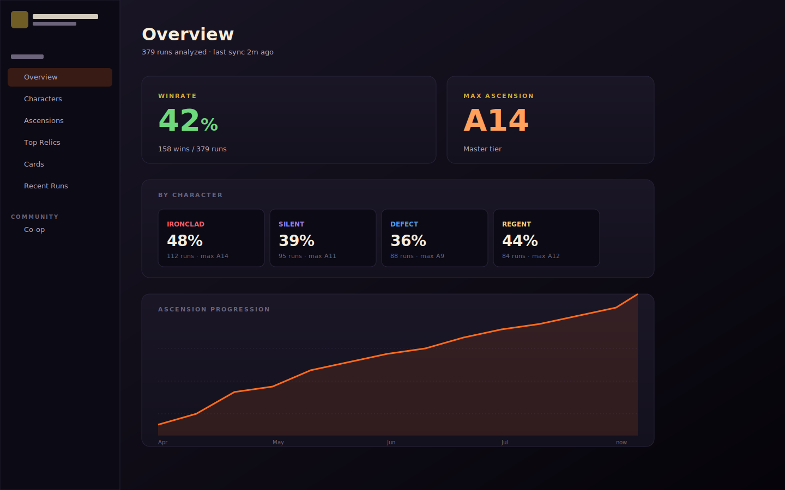

# Spire Vault

A free, open-source companion app for **Slay the Spire 2** that does two
things:

1. Watches your save folder and tracks every run you finish — locally, on
   your own machine, no account required.
2. Shows you a live feed of other people who are online and looking for a
   co-op partner right now, so you can stop scrolling the global Discord
   for an hour every time you want to play.

[](LICENSE)
[](#install)
[](https://app.spirevault.app)
[](https://spirevault.app)

> Not affiliated with Mega Crit Games. *Slay the Spire* is a trademark of
> Mega Crit. This is a fan-made tool that reads files you already have on
> your own computer.

---

## Why this exists

STS2's multiplayer is gated through Steam friends, which is the right call —
it keeps the experience tight and abuse-free. But it leaves a missing
layer: there's no way to *find* a partner before you Steam-friend them.
Today, that means scrolling a Discord with a few hundred users and either
finding a level-0 newbie or someone grinding A20 Heart kills.

I built Spire Vault to fill that exact gap, nothing more. It does not host
games, route invites, or replace anything Mega Crit built. It just shows
you who else is around at your level, and gives you a one-click way to
reach out on Steam or Discord. From there, the actual game session goes
through Steam friends like normal.

The run-tracker came along for the ride because once I was already parsing
my own save files to compute my own skill tier, exposing the rest of the
data in a clean UI was a few extra weekends of work.

## What it looks like

<p align="center">
  
</p>

<p align="center">
  
</p>

<p align="center">
  
</p>

<sub>Above: representative screens. Real captures replace these in
the GitHub Release notes.</sub>

## Install

There are two ways in. Both are free, both share the same live presence
feed, and you can use them on the same Steam account.

### Native macOS app — recommended for Mac users

1. Grab the latest **`Spire-Vault-vX.Y.Z.dmg`** from the
   [Releases](https://github.com/c3rooks/SpireVault/releases) page.
2. Open the DMG and drag **The Vault** to your Applications folder.
3. First launch is ad-hoc signed (I don't pay Apple's $99/yr developer fee
   just to keep this free), so right-click the app → **Open**, then click
   **Open** in the dialog. macOS only asks once.

That's the whole install. The app auto-detects your STS2 save folder.
Co-op is one click away under the **Co-op** tab when you're ready.

### Web companion — Windows, Linux, Chromebooks, anywhere

If you're not on a Mac, open **<https://app.spirevault.app>** in any modern
browser and click *Sign in with Steam*. You get the entire co-op finder
with no install, no download, no account. The run-tracker isn't there
because it needs read access to your local save folder, which the browser
sandbox doesn't allow — that's a real limitation, not a deliberate one.

A native Windows build is on the roadmap but it's a full rewrite (the Mac
app is SwiftUI, which is Apple-only), so for now the web companion is the
official Windows and Linux path.

## How co-op actually works

Some people ask if I'm trying to replace Steam multiplayer or matchmake
for them. I'm not. Here's the four-step flow:

1. **Sign in with Steam.** Standard Steam OpenID — the same flow Steam uses
   for every other site. Your password never reaches my server.
2. **See who's online.** The Co-op tab shows everyone else with Spire
   Vault open right now. You see their Steam persona, avatar, current
   status (Looking / Playing / Idle), an optional self-declared skill
   tier, and an optional Discord handle.
3. **Reach out.** One click opens their Steam profile, copies their
   Discord handle to your clipboard, or fires `steam://friends/add/<id>`.
4. **Play.** You coordinate the rest over Steam or Discord — agreeing on
   a time, picking characters, whatever. The actual STS2 multiplayer game
   gets hosted and joined the same way you'd do it today.

Total infrastructure cost: **$0**. The whole thing runs on Cloudflare's
free tier. The only fixed cost in this entire project is the $14/year
domain, which I'm paying out of pocket because I think solving this
problem is worth fourteen bucks.

## Privacy, in plain English

The run tracker is fully offline. Nothing about your runs, decks, win
rates, or anything else ever leaves your Mac unless you sign into co-op.

When you sign into co-op, the server stores:

- Your verified Steam ID, persona name, and avatar URL (all from the
  public Steam Web API; nothing private).
- A status, a freeform note, and an optional Discord handle — whatever
  *you* type into the app.
- A session token, valid for 30 days. Sign out and it's gone instantly.

That's the entire list. The server cannot read your save folder, run
history, password, email, payment info, or anything else, because it
isn't sent and never has been. I documented the full threat model and
what's deliberately out of scope in [SECURITY.md](SECURITY.md).

If you want to verify all this yourself, the Worker code in `Backend/`
is the exact code running in production. Anyone can audit it. Anyone can
fork it and point their own Spire Vault at a private deployment.

## Build from source

If you want to run it without trusting a pre-built binary, or you want to
hack on it:

```bash
git clone https://github.com/c3rooks/SpireVault.git
cd SpireVault/VaultApp
brew install xcodegen   # one-time, generates the .xcodeproj
make run
```

Requirements:

- Xcode 16 or later (macOS 13+ deployment target)
- `xcodegen` (one Homebrew install away)
- macOS on Apple Silicon or Intel

The CLI lives at `TheVault/` and builds independently with `swift build`
inside that directory — useful if you want to dump your run history to
JSON or CSV without launching the full app.

## Repository layout

```
.
├── VaultApp/        Native macOS SwiftUI app (the thing you install)
├── TheVault/        Swift package: VaultCore library + `vault` CLI
├── Backend/         Cloudflare Worker for the co-op presence feed
├── Site/            Marketing landing page  (spirevault.app)
├── Web/             Browser companion         (app.spirevault.app)
├── SECURITY.md      Threat model + what's defended-against
└── RELEASING.md     How to cut a new release
```

`VaultApp` depends on `TheVault` for parsing/stats so the two share code
without duplicating it. `Site` and `Web` are pure-static Cloudflare Pages
deployments — no build step, no runtime dependency. `Backend` is a single
Worker, around 1k lines of TypeScript total.

### Where each piece is hosted

| Component       | Hosted on              | URL                                              |
| --------------- | ---------------------- | ------------------------------------------------ |
| macOS app       | GitHub Releases        | [`/releases`](https://github.com/c3rooks/SpireVault/releases) |
| Backend Worker  | Cloudflare Workers     | `vault-coop.coreycrooks.workers.dev`             |
| Marketing site  | Cloudflare Pages       | <https://spirevault.app>                         |
| Web companion   | Cloudflare Pages       | <https://app.spirevault.app>                     |

## Contributing

Issues and PRs welcome. The project is small enough that "open a PR" is
the entire workflow — no CLA, no contributor guide novella. If you want
to add a feature and aren't sure if I'd merge it, open an issue first
and ask.

If you find a security issue, please email me before opening a public
issue — instructions in [SECURITY.md](SECURITY.md).

## License

[MIT](LICENSE). Do whatever you want with it.

## Thanks

To Mega Crit, for making the best card game ever and not getting weird
about fan tools. To everyone who asked "is anyone else online right now?"
in the STS2 Discord and didn't get an answer — this is for you.
