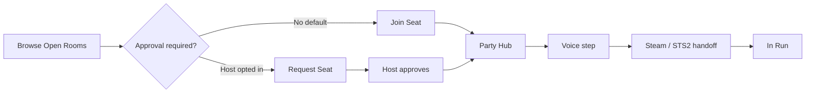

# Co-op Lobby Beta — Product / UX Reset Plan

**Status:** Approved — **Phase 1 (slice 1) in progress** on `feature/coop-party-room-bridge`.  
**Branch context:** Open Join + Party Hub at `/party/:partyId`.  
**Last updated:** 2026-05-19

---

## Executive summary

SpireVault does **not** replace Discord. It makes **Discord LFG easier** for Slay the Spire 2 multiplayer.

**Product angle:**  
> Stop scrolling LFG chat. See open STS2 parties, claim a seat, join voice, and get into the run.

**Core shift:** Move from **permission-first** (“Request Seat → wait for host → maybe Party Room”) to **claim-first** (“Join Seat → Party Hub immediately”). Host approval becomes **opt-in**, not default.

---

## Current problems (why we reset)

| Problem | User impact |
|--------|-------------|
| **Seat Requests dominates the page** | Feels like an admin inbox, not a game lobby |
| **Too many panels at once** | Seat Requests, Open Lobbies, Best Matches, Players Looking Now, right rail, How It Works — no single “what do I do?” |
| **Best Matches duplicates active lobbies** | Same room appears twice; user already committed to a flow |
| **Request Seat = asking permission from a stranger** | Social friction; worse than scrolling Discord |
| **Party Room feels disconnected** | Payoff arrives late, after approval, on another route |
| **Pending requests counted as filled seats** (bugs in some builds) | 2/4 shown when only host accepted |
| **Steam on public cards** | Wrong trust model; sandbox opens real Steam errors |
| **Does not clearly beat Discord yet** | Extra steps without faster path to voice + run |

**What we built on the branch is useful engineering** (slots, party records, sandbox) but the **default mental model is wrong** for LFG Discord refugees.

---

## Product positioning

### We are

- A **room browser** for STS2 co-op parties (Standard / Daily / Custom).
- A **Party Hub** that gets strangers aligned: who’s in, voice link, Steam steps, ready state.
- A **Discord LFG assistant** (copy-paste post, voice channel field, no DM required to “ask”).

### We are not

- Steam matchmaking replacement.
- A second Discord.
- A 1:1 cold-invite / “message stranger” network.
- An AI run coach surface (no BYOK, no models, no API keys in co-op).

---

## New default flow (happy path)



### Default: Open Join

1. User sees **Open Rooms** (not “Open Run Lobbies” in UI — shorter, gamer language).
2. User clicks **Join Seat** on an open room.
3. User **immediately claims** an open slot (no host tap).
4. **Party Hub** opens immediately at dedicated full-page route **`/party/:partyId`** (no slide-over in v1).
5. Party Hub guides: members → voice → Steam → STS2 → Ready / In Game.

### Optional: Approval Required

- Host toggles **Approval required** when posting a room (off by default).
- Only then does the primary CTA become **Request Seat**.
- Copy: “Host must accept before you enter the party.”
- Until accept: state **approval_pending** — no Party Hub for joiner (or read-only preview — **not** in v1; keep simple: waiting screen only).

---

## Simplified state machine

One **dominant next step** per state. Hide or collapse everything else.

| State | User situation | Dominant panel (only hero) | Secondary (allowed) |
|-------|----------------|----------------------------|---------------------|
| **idle** | Not in room/party | Choose: **Join Room** (browse) · **Host Room** · **Quick Match** | Open Rooms list (preview) |
| **browsing** | Scrolling rooms | Same as idle + scroll emphasis | Open Rooms full list |
| **joined_party** | Claimed seat or accepted | **Party Hub** (members, voice, Steam, ready) | Leave party |
| **hosting** | Host of open room | **Your Room** (slots, joiners, Copy Discord LFG Post) | Manage / Close |
| **approval_pending** | Requested seat (approval room only) | **Waiting for host** + Cancel | Browse other rooms (collapsed note) |
| **in_sts2_lobby** | Party marked character select | Party Hub — STS2 lobby step highlighted | — |
| **in_run** | In game | **In Run** — invites/join disabled | — |
| **away** | AFK / hidden | Minimal status + return to Looking | — |

**Removed as top-level concepts:** giant “Seat Requests” section, competing “Current Activity” duplicates, Best Matches while active.

### State resolution rules (priority order)

1. `in_run` → party/lobby in run  
2. `in_sts2_lobby` → party status character_select (or equivalent)  
3. `joined_party` → user in `acceptedMemberSteamIds` for active party  
4. `approval_pending` → user in `pendingSeatRequestSteamIds` for a room with `approvalRequired: true`  
5. `hosting` → user is host of active open room  
6. `browsing` → user on co-op tab, no active party/room obligation (optional fine-grain)  
7. `idle` → default  

---

## Room card spec (lobby, not data card)

Each **Open Room** card must answer in &lt;2 seconds: *what run, who hosts, can I join, how full?*

### Required fields (visual hierarchy)

1. **Title** — e.g. `Standard · A10 Heart Attempt`  
2. **Mode badge** — Standard / Daily / Custom  
3. **Host** — persona name + avatar (sandbox-safe)  
4. **Seat row** — filled avatars + empty slots (visual)  
5. **Fill text** — `2/4 seats · Need +2` (only **accepted** members count)  
6. **Goal + ascension** — compact badges (A0–A10 only)  
7. **Voice** — No voice / Any voice / LFG 1 / LFG Duo 3 / Custom link (see model)  
8. **Note** — one line, subdued  

### Primary CTA (one per card)

| Room setting | Primary button | Secondary |
|--------------|----------------|-----------|
| `approvalRequired: false` (default) | **Join Seat** | Details (optional) |
| `approvalRequired: true` | **Request Seat** | Details |

### Host-only on own card

- **Manage** · **Close room** · **Copy Discord LFG Post**

### Never on public card (before join)

- Steam profile button  
- “Invite” as primary CTA  
- Open Party Hub (joiners only after claim/accept)

---

## Party Hub (main payoff)

Rename user-facing: **Party Hub** (internal route may stay `/party/:partyId`).

### After Join Seat (open join)

Party Hub opens **immediately**.

### Sections (fixed order)

1. **Party** — Host, members, empty seats, mode, goal  
2. **Next step** (role-specific one-liner)  
   - Host: “Host the game in STS2”  
   - Joiner: “Join through Steam”  
3. **Checklist** (host vs joiner — existing copy, tightened)  
4. **Actions** — Ready · On Character Select · Waiting for Invite · In Game · Leave · End Party (host)

### Voice step (in Hub)

- Show room’s voice choice + link if Custom  
- CTA: **Open voice channel** (external link) when `voiceChannelUrl` or preset maps to URL  
- Copy: “Join voice before launching STS2” (optional, not blocking)

### Steam step

- **Copy Host Steam Profile** / **Copy Player Steam Profile** — only here, only after join  
- Sandbox: toast “Sandbox user — no real Steam profile”

### Help (always visible, collapsed)

> If STS2 says “No friends currently playing multiplayer,” add the host on Steam first. Then refresh after the host reaches character select.

### approval_pending (not in Hub yet)

- Full-screen or dominant card: **Waiting for {{host}}**  
- Buttons: **Cancel request** · **Browse other rooms**  
- No Party Hub until accepted

---

## Discord integration (support, not replace)

### Room fields (host sets at post time)

| Field | Values |
|-------|--------|
| **Voice** | No voice · Any voice · LFG 1 · LFG Duo 3 · Custom link (+ URL) |

- Presets are labels + optional default Discord channel URLs (host pastes once, saved on room).  
- **Custom link** = host supplies voice URL (Discord channel invite).

### Host action: Copy Discord LFG Post

Generates paste-ready text, e.g.:

```
STS2 {{mode}} · {{goal}} · {{ascension}} · {{filled}}/{{size}} · Need +{{need}}
Host: {{persona}}
Voice: {{voiceLabel}} {{voiceUrl}}
Join on SpireVault: https://spirevault.app/coop?room={{roomId}}
```

Host still posts to Discord manually — we **speed up** the post and link back to the room.

---

## UI components to change (when implementing)

| Component | Change |
|-----------|--------|
| `#coop-primary-state` | Rewrite copy/CTAs per new state machine |
| Open Rooms list | Rename from “Open Run Lobbies”; room cards per spec |
| Host a Room modal | Title **Host a Room**; add **Approval required** toggle (default off); voice presets |
| Primary CTAs | **Host a Room**, **Join a Room**, **Quick Match**; object word **Room** |
| Remove / shrink | `#coop-invites-section` as dominant (legacy invites only) |
| Best Matches | Secondary; **hidden** unless `idle` |
| Players Looking Now | **Collapsed by default**; never hero |
| Right rail | Mirror single state; no duplicate CTAs |
| Party Room → Party Hub | Rename strings; same route OK |
| Quick Match | “Find Me a Group” → prefer open join rooms first |
| Dev Sandbox | New scenarios (below) |

**Do not add** new top-level nav or third co-op mode.

---

## Required data model changes

Extend `RunLobby` (and API) — backward compatible defaults:

| Field | Type | Default | Notes |
|-------|------|---------|--------|
| `approvalRequired` | boolean | `false` | If true, use Request Seat flow |
| `voicePreset` | enum | `any` | `none` \| `any` \| `lfg1` \| `lfg_duo3` \| `custom` |
| `voiceChannelUrl` | string? | null | Required when preset = custom |
| `discordPostTemplate` | string? | null | Optional override; else generated |
| `roomDeepLink` | string | computed | `https://spirevault.app/coop?room={{roomId}}` (Discord posts; app may redirect internally) |

### Seat / party rules (enforce server-side)

- **Join Seat** (open join): atomically add user to `acceptedMemberSteamIds` if slot available; create/update party; return `partyId`.  
- **Request Seat** (approval): add to `pendingSeatRequestSteamIds` only; **do not** increment filled seats.  
- **Accept** (host): move pending → accepted; mint/update party.  
- **Only `acceptedMemberSteamIds` count** toward `filled` / `Need +N`.  

### Party Hub record

- Keep `coop:party:*` — rename user-facing only.  
- Member statuses: `joined` \| `ready` \| `character_select` \| `in_game` \| `left`  

### Migration

- Existing lobbies without `approvalRequired` → treat as `false`.  
- Existing pending requests on old “approval by default” rooms → one-time sandbox reset; prod cutover note below.

---

## Section visibility matrix

| Section | idle | browsing | joined_party | hosting | approval_pending | in_run |
|---------|------|----------|--------------|---------|------------------|--------|
| Primary state hero | ✓ | ✓ | ✓ | ✓ | ✓ | ✓ |
| Open Rooms | ✓ | ✓ | optional | pin yours | optional | hide |
| Best Matches | secondary | secondary | **hide** | **hide** | **hide** | **hide** |
| Players Looking Now | collapsed | collapsed | collapsed | collapsed | collapsed | collapsed |
| Seat Requests panel | hide* | hide* | hide | inline on host | hide | hide |
| How It Works | collapsed | collapsed | collapsed | collapsed | collapsed | collapsed |

\*Show only if legacy 1:1 co-op invites exist in inbox.

---

## Acceptance criteria

### Product

- [ ] Default room is **Open Join**; user reaches Party Hub in **one click** after Join Seat.  
- [ ] **Approval required** is opt-in; Request Seat only when enabled.  
- [ ] User always sees **one** dominant next step for their state.  
- [ ] Best Matches hidden when user is hosting, in party, or approval pending.  
- [ ] Players Looking Now collapsed by default.  
- [ ] No Steam button on public room cards.  
- [ ] Pending requests never increase seat count.  
- [ ] Host can **Copy Discord LFG Post** from hosting state / Party Hub.  
- [ ] Voice preset visible on card and in Party Hub.  

### Local sandbox

- [ ] Seed open rooms (approval off) → Join Seat → Party Hub joiner.  
- [ ] Seed approval room → Request Seat → host approve → Party Hub.  
- [ ] Party Hub host checklist vs joiner checklist.  
- [ ] Copy Discord LFG Post produces valid text.  
- [ ] Sandbox Steam actions never open steamcommunity.com.  
- [ ] Reset sandbox wipes all fake state.  

### Safety

- [ ] Classic Co-op unchanged when beta off.  
- [ ] No third co-op route.  
- [ ] Production deploy requires feature flag + KV migration notes.  

---

## What NOT to build (this reset)

- Desktop overlay / Party Bridge exe (deferred).  
- AI Run Coach, BYOK, model providers in co-op UI.  
- Auto-DM strangers / cold 1:1 invite as primary path.  
- Steam friends API / in-game injection.  
- Full Discord bot or webhook automation (copy-paste only).  
- Public global chat.  
- Skill-based matchmaking ELO.  
- “Session” / “intent” / “temporary lobby” user-facing words.  
- Giant Seat Requests dashboard.  
- A20 or STS1 ascension references (max **A10**).  
- Third co-op UI mode or `/coop-v3`.  

---

## Rollout safety

1. **Do not deploy** current branch UX as-is to production.  
2. Implement reset behind same beta flag (`spirevault.coopLobbyBeta`).  
3. **KV:** new fields default safely; old lobbies without `approvalRequired` behave as open join.  
4. **Communicate** to Discord LFG: “claim seat on SpireVault, voice link in party, then STS2.”  
5. **Metrics** (future): `join_seat`, `request_seat`, `party_hub_open`, `discord_post_copy`, `ready`, `in_game` — admin counters only when stable.  
6. **Rollback:** beta flag off → Classic Co-op only.  

---

## Dev sandbox scenarios (required for QA)

| Scenario | Purpose |
|----------|---------|
| A — Empty | Idle hero only |
| B — Open rooms (approval off) | Join Seat → immediate Party Hub |
| C — Approval room + pending | Request Seat, 1/4 seats, no Hub for joiner |
| D — Host with pending | Inline accept/decline, seats still 1/4 |
| E — Accepted party | 2/4, Party Hub both personas |
| F — Full room | Join disabled, Full badge |
| G — In run | Join disabled, In Run state |
| Reset | Wipe KV + localStorage dev keys |
| Persona switch | Host vs joiner Party Hub |

---

## Implementation order (after plan approval)

1. **Backend:** `approvalRequired`, voice fields, Join Seat atomic endpoint, seat math fix.  
2. **State machine UI:** primary panel + section visibility.  
3. **Room cards:** visual seat row + CTA swap.  
4. **Party Hub:** rename, voice block, Discord post copy.  
5. **Sandbox:** scenarios B–E updated.  
6. **QA:** run local test script in this doc + remove dev BOOT banner if any remains.  

---

## Decided (approved 2026-05-19)

| # | Decision |
|---|----------|
| 1 | **Party Hub route:** dedicated full-page **`/party/:partyId`** only — no slide-over for v1. Deep-linkable, refresh-safe. |
| 2 | **Full rooms:** disable join, show **Full**. **No waitlist** in v1. |
| 3 | **Leaving:** joiner leaves **instantly** without host approval. Host leave/close → room closes; members see **“Host closed the room.”** |
| 4 | **Deep link:** `https://spirevault.app/coop?room={{roomId}}` in Discord posts (app redirects safely if internal route differs). |
| 5 | **Rename (reset UI):** modal **“Host a Room”**, **“Join a Room”**, **“Quick Match”**; object **Room**; CTAs **Join Seat** / **Request Seat** (approval only). Avoid **“Post a Run”** in reset UI unless needed for code-risk areas. |

---

## References

- `docs/coop-party-room-bridge.md` — current branch scope  
- `docs/coop-run-lobby-upgrade-plan.md` — original lobby model  
- `docs/coop-sandbox.md` — local testing  

---

**Next step:** Continue slice implementation (Open Join → Party Hub) on `feature/coop-party-room-bridge` — **no production deploy** until flagged.
